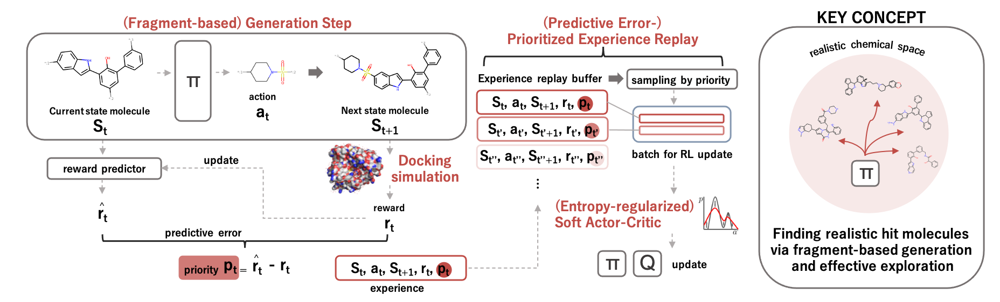
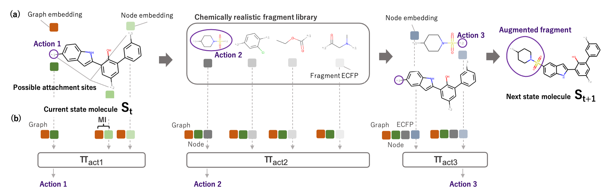

# Fragment-based generative RL with Explorative Experience replay for Drug design (FREED)

This repository is the official Pytorch implementation of "Hit and Lead Discovery with Explorative RL andFragment-based Molecule Generation"





## Setup Python environment
for GPU usage,
DGL requires CUDA **10.0** or higher.

```
# Install python environment
conda env create -f environment_freed.yml # for gpu usage
conda env create -f environment_freed_cpu.yml # for cpu usage

# Activate environment
conda activate freed_pt
```

## Usage

```
# Start training with FREED - predictive error(PE), target: fa7, fragment vocab: 91 random fragments

# Check which target you want to optimize for.
vim run_rl_XXXX.sh # -> set --target='fa7'
# Currently supported Targets are 'fa7', 'parp1', '5ht1b'.

# Check which fragment vocab you are using.
vim gym_molecule/envs/env_utils_graph.py
# SFS_VOCAB = open('gym_molecule/dataset/VOCAB_TO_USE.txt','r').readlines()
# Currently supported VOCABs are 'motifs_zinc_random_92.txt'(91 random fragments), 'motif_cleaned.txt'(66 filtered fragments)

# To run FREED - predictive error(PE):
bash run_rl_intr.sh

# To run FREED - Bayesian uncertainty(BU):
bash run_rl_mc.sh

# To run PER with TD error:
bash run_rl_per.sh

# To run Curiosity driven model with predictive error:
bash run_rl_curio_intr.sh

# To run Curiosity driven model with Bayesian uncertainty:
bash run_rl_curio_mc.sh

# To run Vanilla SAC model:
bash run_rl.sh

# To run baseline PPO:
bash run_rl_ppo.sh
```

Generated molecules are stored in ./molecule_gen

If you want to train model in hit-to-lead scenario instead of de novo generation,

1. Set 'self.starting_smi' to the smiles string of scaffold you wish to start.
   This could be set in 'def init' of 'class MoleculeEnv', 'gym_molecule/envs/molecule_graph.py'.

2. Set appropriate 'max_action' argument (2 in our case) in .sh file that you want to run.

## Metrics & Generated Molecules

In order to measure Quality score, hit ratio, and top 5% score,

move your molecules generated in ./molecule_gen/ to ./rl_final_results/molecule_gen/.

To measure quality score:

```
python filter.py
```

To measure hit ratio and top 5% score,
```
python enrichment.py
```

Generated moleculed can be acquired by
```
cd rl_final_results/
gdown https://drive.google.com/uc?id=1724OJkPAraIIio9c9_48cKo-x17ALLXO
tar -zxvf molecule_gen.tar.gz
```

Quality score, hit ratio, and top 5% score of generated molecules can be calculated by
```
cd rl_final_results/libs/

# For quality score
python filters.py --data [path_to_csv]
# e.g. python filters.py --data ../molecule_gen/5ht1b_cleaned_alr5e-4_freed_pe_141.csv

# For hit ratio and top 5% score
python enrichment.py [path_to_csv]
# e.g. python enrichment ../molecule_gen/5ht1b_cleaned_alr5e-4_freed_pe_141.csv

```

Descriptions to generated molecules are written in rl_final_results/molecule_gen/README.md
